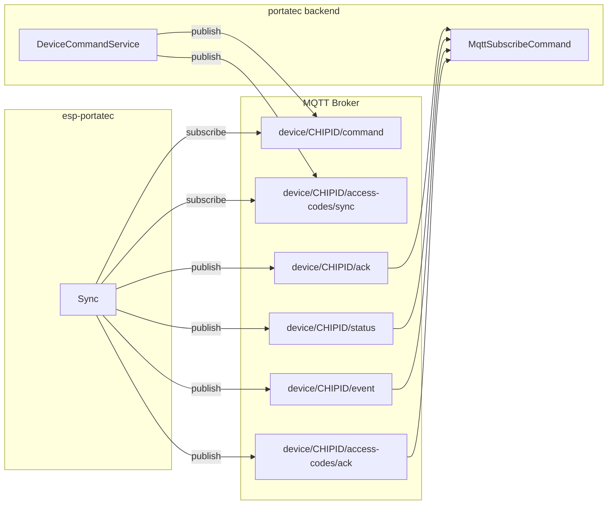

# Plano de Refatoração: esp-portatec para MQTT

Documento de planejamento da migração da comunicação do dispositivo com o backend de WebSocket (Pusher) para MQTT, alinhado à refatoração do repositório **portatec**.

---

## Situação atual

**esp-portatec (dispositivo):**
- Comunicação via **WebSocket** (Pusher) em `portatec.medeirostec.com.br:443`, usando `API_KEY` em `globals.cpp`.
- Classe `Sync` (`src/Sync/Sync.cpp`) concentra: conexão, subscribe em canal `device-sync.{chipId}`, tratamento de eventos Pusher e envio de mensagens.
- Eventos recebidos: `pusher:ping`, `pusher:connection_established`, `pusher_internal:subscription_succeeded`, `pulse`, `access-pin`, `update-firmware`.
- Eventos enviados: `client-device-status`, `client-sensor-status`, `client-pin-usage`, `client-command-ack`, `client-diagnostic`.
- Dependência: `Links2004/WebSockets` e `ArduinoJson`.

**portatec (backend):**
- Já usa **MQTT** (`php-mqtt/laravel-client`), config em `config/mqtt-client.php` (host, port 1883, client_id, etc.).
- **Publicação para o dispositivo:** `DeviceCommandService` publica em:
  - `device/{external_device_id}/command` — payload: `command_id`, `action`, `pin`, `timestamp` (ISO8601).
  - `device/{external_device_id}/access-codes/sync` — payload: `command_id`, `action: "sync_access_codes"`, `default_pin`, `access_codes[]` (cada um com `pin`, `start`, `end` em ISO8601), `timestamp`.
- **Subscrição (dispositivo -> backend):** `MqttSubscribeCommand` escuta:
  - `device/+/ack` — ACK de comandos (usa `pin`, `action` ou `command`).
  - `device/+/pulse` — trata como heartbeat/status (atualiza `last_sync`, dispara evento).
  - `device/+/status` — mesmo handler que pulse (heartbeat).
  - `device/+/event` — evento de acesso: `pin` (código usado), `result` (valid/invalid), `timestamp_device` (opcional).
  - `device/+/access-codes/ack` — confirmação de sync de códigos (apenas log).

---

## Mapeamento de comunicação

---

## Tabela de equivalência (Pusher -> MQTT)

| Atual (Pusher) | Novo (MQTT) | Payload esperado pelo backend |
|----------------|-------------|-------------------------------|
| Recebe: `pulse` | Subscreve: `device/{chipId}/command` | `command_id`, `action`, `pin`, `timestamp` |
| Recebe: `access-pin` (create/update/delete) | Subscreve: `device/{chipId}/access-codes/sync` | `command_id`, `action: "sync_access_codes"`, `default_pin`, `access_codes[]` com `pin`, `start`, `end` (ISO8601) |
| Recebe: `update-firmware` | Manter por enquanto via HTTP/OTA (backend não publica OTA via MQTT) ou definir novo tópico | - |
| Envia: `client-command-ack` | Publica: `device/{chipId}/ack` | `pin` (GPIO ou string), `action` ou `command` |
| Envia: `client-device-status` | Publica: `device/{chipId}/status` | Qualquer payload; backend chama `handlePulse` (atualiza last_sync) |
| Envia: `client-sensor-status` | Decidir: mesmo `status` com campo tipo ou tópico separado | Backend hoje não trata sensor; pode ir em `status` com campo ex. `sensor_value` |
| Envia: `client-pin-usage` | Publica: `device/{chipId}/event` | `pin` (código usado), `result` (valid/invalid), `timestamp_device` (unix opcional) |
| Envia: ACK de access-codes | Publica: `device/{chipId}/access-codes/ack` | Log apenas |
| Envia: `client-diagnostic` | Opcional: `device/{chipId}/event` com tipo ou tópico `device/{chipId}/diagnostic` | Backend não subscreve diagnostic hoje; definir se será usado |

---

## Ajustes de payload e ACK

1. **ACK (`device/{chipId}/ack`):** Backend usa `action` ou `command` e `pin` (string). Hoje o ESP envia `command` e `pin` (GPIO). Manter `pin` como número do GPIO e enviar `action` igual ao comando recebido (ex.: `pulse`, `toggle`) para compatibilidade com `DeviceCommandService::handleAck` e testes em `DeviceCommandServicePayloadMappingTest.php`.
2. **Evento de acesso (`device/{chipId}/event`):** Backend espera `pin` = código digitado (string), `result` = "valid" ou "invalid", e opcionalmente `timestamp_device` (unix). Hoje o ESP envia `client-pin-usage` com `pin_id` e `timestamp`. É necessário alterar para enviar o **código usado** e o resultado (ex.: `sendAccessEvent(String code, String result, unsigned long timestamp)`), e chamar isso a partir do fluxo de validação em `Webserver::handlePulse` (onde já se tem o código e o resultado).
3. **Access codes sync:** Backend envia `access_codes[].pin` (código), `start`/`end` em ISO8601. No ESP, `AccessManager` usa `id`, `code`, `start`/`end` em unix. Será necessário:
   - Interpretar ISO8601 no ESP (biblioteca de parsing ou timestamps em segundos se o backend passar a enviar unix) para popular `start`/`end`.
   - Mapear cada item do array para create/update no `AccessManager`; como o backend não envia `id`, usar o índice ou o próprio `pin` (código) como chave para update/delete.
4. **Heartbeat:** Enviar periodicamente para `device/{chipId}/status` (ex.: mesmo JSON de device-status atual) para manter `last_sync` e eventos de UI no backend.
5. **Firmware OTA:** Hoje acionado por evento WebSocket. Opções: (a) novo tópico `device/{chipId}/command` com `action: "update_firmware"` e o ESP inicia OTA via HTTP como hoje; (b) manter trigger por outro canal. Recomendação: usar o mesmo tópico `command` com `action: "update_firmware"` para consistência.

---

## Arquivos principais a alterar (esp-portatec)

- **`src/Sync/Sync.h` e `Sync.cpp`:** Substituir WebSocket por cliente MQTT; subscrever `device/{chipId}/command` e `device/{chipId}/access-codes/sync`; publicar em `ack`, `status`, `event`, `access-codes/ack`; adaptar parsing de comandos e de access-codes (ISO8601); implementar heartbeat em `status`.
- **`src/Webserver/Webserver.cpp`:** Trocar `sendPinUsage(authorizedId)` por envio de evento de acesso com código e resultado (ex.: `sync.sendAccessEvent(pin, "valid", systemClock.getUnixTime())` e no caso de falha `sync.sendAccessEvent(pin, "invalid", ...)`).
- **`src/AccessManager/AccessManager.cpp`:** Se for necessário expor o código por id (para evento), ou manter apenas o fluxo "código + result" vindo do Webserver.
- **`src/globals.h` / `globals.cpp`:** Remover ou reutilizar `API_KEY`; adicionar configuração MQTT (host, port, client_id, user/password se houver), preferencialmente gravada em EEPROM/DeviceConfig junto com WiFi.
- **`platformio.ini`:** Trocar dependência `WebSockets` por uma lib MQTT para ESP8266 (ex.: `knolleary/PubSubClient` ou `256dpi/arduino-mqtt`).
- **`DeviceConfig`:** Incluir campos para MQTT (host, port, opcionalmente user/pass) se não quiser hardcode; senão usar constantes em tempo de compilação.

---

## Dependências e configuração MQTT no ESP

- **Biblioteca MQTT:** PubSubClient é comum no ESP8266; verificar se o broker usado pelo backend suporta (porta 1883, MQTT 3.1). Config do backend em `config/mqtt-client.php` e variáveis de ambiente (MQTT_HOST, MQTT_PORT, etc.) definem o broker; o ESP deve usar o mesmo host/porta.
- **Client ID:** Backend usa `MQTT_CLIENT_ID` para o *serviço Laravel*; cada dispositivo deve ter client_id único (ex.: `esp-{chipId}`) para evitar conflitos.
- **Segurança:** Se no futuro o backend usar MQTT com usuário/senha ou TLS, o DeviceConfig e o cliente MQTT no Sync precisarão suportar.

---

## Ordem sugerida de implementação

1. Adicionar lib MQTT ao projeto e configuração (host, port, client_id) em DeviceConfig ou globals.
2. Criar módulo/camada de conexão MQTT (connect, loop, reconnect) e substituir o uso de WebSocket em `Sync` pela conexão MQTT.
3. Implementar subscribe nos tópicos `device/{chipId}/command` e `device/{chipId}/access-codes/sync` e tratar mensagens (pulse/comando genérico, sync_access_codes, e depois update_firmware).
4. Implementar parsing de access_codes (ISO8601 -> unix) e chamadas ao AccessManager (create/update/delete por código ou índice).
5. Implementar publicações: ACK (`ack`), status/heartbeat (`status`), evento de acesso (`event`), access-codes/ack (`access-codes/ack`), com payloads no formato esperado pelo backend.
6. Ajustar Webserver e fluxo de validação de PIN para enviar evento de acesso (código + result) em vez de pin_usage por id.
7. Tratar comando `update_firmware` no handler de `command` e manter fluxo OTA via HTTP atual.
8. Remover dependência WebSockets e código Pusher; atualizar README e comentários com o novo protocolo MQTT.
9. Testes manuais com broker real e backend (mqtt:subscribe rodando); validar ACK, status, event e access-codes/ack no backend.

---

## Pontos a refinar

1. **OTA (update-firmware):** Confirmar se o backend vai publicar em `device/{chipId}/command` com `action: "update_firmware"` ou se haverá tópico dedicado.
2. **Sensor (gate open/closed):** Enviar no mesmo `status` com um campo (ex. `sensor_value` ou `sensor_pin`) ou criar tópico `device/{chipId}/sensor` e o backend passar a subscrever?
3. **Diagnostic:** Manter evento de diagnóstico; se sim, criar tópico `device/{chipId}/diagnostic` e o backend subscrever, ou ignorar por enquanto?
4. **Formato de datas no sync de access_codes:** Manter ISO8601 e implementar parsing no ESP, ou o backend pode enviar também `start_unix`/`end_unix` para facilitar no dispositivo?
5. **Credenciais MQTT:** O broker atual usa usuário/senha? Se sim, onde guardar no dispositivo (DeviceConfig/EEPROM)?

Com essas definições, o plano pode ser detalhado em tarefas por arquivo e por PR.
